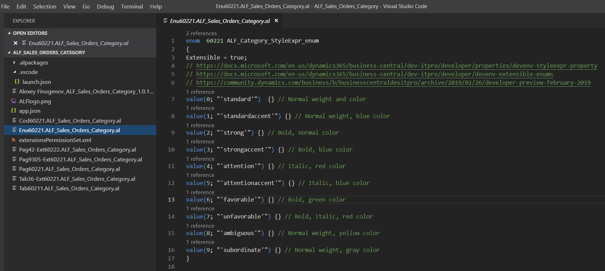

## ALF Sales Orders Category

> ALF Sales Orders Category – add possibility to categorize ‘Sales Order’ by small color text note.

Github project: <https://github.com/finn777/ALF_Sales_Orders_Category>
 
Readme: <https://github.com/finn777/ALF_Sales_Orders_Category/blob/master/readme.md>
 
.app file:  

App pictures -

Useful links:

<https://docs.microsoft.com/en-us/dynamics365/business-central/dev-itpro/developer/properties/devenv-styleexpr-property>
<https://docs.microsoft.com/en-us/dynamics365/business-central/dev-itpro/developer/devenv-extensible-enums>
<https://community.dynamics.com/business/b/businesscentraldevitpro/archive/2019/02/26/developer-preview-february-2019>
<https://community.dynamics.com/business/f/758/tags/Alexey%2bFinogenov>